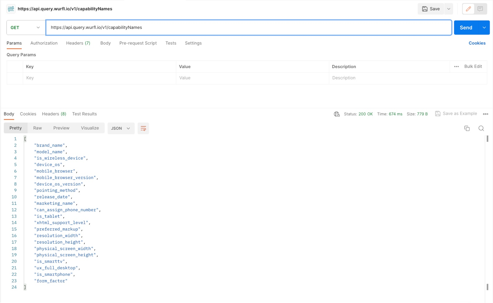

## How to start:
1. Run Gradle tasks clean build
2. Create an Application configuration in IntellijIdea with following details:

   - JDK -> your current JDK
   - -cp -> device-booking-service.main
   - Main class -> com.devicebooking.example.ApplicationKt
   - Environment variables(optional) -> APPLICATION_NAME=device-booking-service;LOGBACK_APPENDER=STDOUT 

## Fonoapi problem

1. Currently, Fonoapi doesn't work, it's impossible to take a token.

   

2. There is analogue of it: https://api.query.wurfl.io but it doesn't provide all needed information (no info about bands
  etc.) (https://api.query.wurfl.io/v1/docs/#operation/find-devices-by-model-name)




3. There was one another option: open databases, like https://dbpedia.org/page/Samsung_Galaxy_Fold:
   But we cannot use them because it doesn't provide the needed information: 2g bands + technology

4. We can try to use another open database, like this one: https://github.com/OpenDDRdotORG/OpenDDR-Resources
   But unfortunately it doesn't suit our need because of the same reason:

```xml

<device id="MZ609" parentId="genericMotorola">
    <property name="model" value="MZ609"/>
    <property name="marketing_name" value="DROID XYBOARD 8.2 32GB"/>
    <property name="displayWidth" value="800"/>
    <property name="displayHeight" value="1280"/>
    <property name="mobile_browser" value="Android Webkit"/>
    <property name="mobile_browser_version" value="4.0"/>
    <property name="device_os" value="Android"/>
    <property name="device_os_version" value="3.2"/>
    <property name="inputDevices" value="touchscreen"/>
    <property name="dual_orientation" value="true"/>
    <property name="is_tablet" value="true"/>
    <property name="ajax_support_javascript" value="true"/>
    <property name="ajax_support_getelementbyid" value="true"/>
    <property name="ajax_support_inner_html" value="true"/>
    <property name="ajax_manipulate_dom" value="true"/>
    <property name="ajax_manipulate_css" value="true"/>
    <property name="ajax_support_events" value="true"/>
    <property name="ajax_support_event_listener" value="true"/>
    <property name="image_inlining" value="true"/>
    <property name="from" value="oddr"/>
</device>
```

5. We can try to get the information from the website: https://www.gsmarena.com/samsung_galaxy_s9-8966.php
   This website has all needed data for us, but we need to grab it somehow.
   
6. We finally can ask ChatGPT to give us already parsed information in needed format. And call its API on crone from
   time
   to time to update the existing data. It gave me data in the following format, but I think if I would create a better
   prompt it would work.

```text
Sure! I'm sorry, but I cannot browse external websites like www.gsmarena.com. 
However, I can provide you with the general information regarding the technology, 2G bands, 3G bands, and 4G bands supported by the devices you mentioned. Please note that this information is based on the knowledge I have up until September 2021. Here are the details:

Samsung Galaxy S9: Technology: GSM / CDMA / HSPA / EVDO / LTE 2G Bands: GSM 850 / 900 / 1800 / 1900 - SIM 1 & SIM 2 (dual-SIM model only) 3G Bands: HSDPA 850 / 900 / 1700(AWS) / 1900 / 2100 4G Bands: LTE band 1(2100), 2(1900), 3(1800), 4(1700/2100), 5(850), 7(2600), 8(900), 12(700), 13(700), 17(700), 18(800), 19(800), 20(800), 25(1900), 26(850), 28(700), 32(1500), 38(2600), 39(1900), 40(2300), 41(2500), 66(1700/2100)
Samsung Galaxy S8: Technology: GSM / HSPA / LTE 2G Bands: GSM 850 / 900 / 1800 / 1900 - SIM 1 & SIM 2 (dual-SIM model only) 3G Bands: HSDPA 850 / 900 / 1700(AWS) / 1900 / 2100 4G Bands: LTE band 1(2100), 2(1900), 3(1800), 4(1700/2100), 5(850), 7(2600), 8(900), 12(700), 13(700), 17(700), 18(800), 19(800), 20(800), 25(1900), 26(850), 28(700), 32(1500), 66(1700/2100), 38(2600), 39(1900), 40(2300), 41(2500)
Motorola Nexus 6: Technology: GSM / CDMA / HSPA / LTE 2G Bands: GSM 850 / 900 / 1800 / 1900 3G Bands: HSDPA 800 / 850 / 900 / 1700(AWS) / 1800 / 1900 / 2100 4G Bands: LTE band 1(2100), 2(1900), 3(1800), 4(1700/2100), 5(850), 7(2600), 8(900), 9(1800), 19(800), 20(800), 28(700), 41(2500)
OnePlus 9: Technology: GSM / CDMA / HSPA / LTE / 5G 2G Bands: GSM 850 / 900 / 1800 / 1900 - SIM 1 & SIM 2 3G Bands: HSDPA 800 / 850 / 900 / 1700(AWS) / 1800 / 1900 / 2100 4G Bands: LTE band 1(2100), 2(1900), 3(1800), 4(1700/2100), 5(850), 7(2600), 8(900), 12(700), 13(700), 17(700), 18(800), 19(800), 20(800), 25(1900), 26(850), 28(700), 32(1500), 34(2000), 38(2600), 39(1900), 40(2300), 41(2500), 42(3500), 66(1700/2100)
Apple iPhone 13: Technology: GSM / CDMA / HSPA / EVDO / LTE / 5G 2G Bands: GSM 850 / 900 / 1800 / 1900 3G Bands: HSDPA 850 / 900 / 1700(AWS) / 1900 / 2100 4G Bands: LTE 5G Bands: Sub6/mmWave
Apple iPhone 12: Technology: GSM / CDMA / HSPA / EVDO / LTE / 5G 2G Bands: GSM 850 / 900 / 1800 / 1900 3G Bands: HSDPA 850 / 900 / 1700(AWS) / 1900 / 2100 4G Bands: LTE 5G Bands: Sub6/mmWave
Apple iPhone 11: Technology: GSM / CDMA / HSPA / EVDO / LTE 2G Bands: GSM 850 / 900 / 1800 / 1900 3G Bands: HSDPA 850 / 900 / 1700(AWS) / 1900 / 2100 4G Bands: LTE
iPhone X: Technology: GSM / CDMA / HSPA / EVDO / LTE 2G Bands: GSM 850 / 900 / 1800 / 1900 3G Bands: HSDPA 850 / 900 / 1700(AWS) / 1900 / 2100 4G Bands: LTE
Nokia 3310: Technology: GSM 2G Bands: GSM 900 / 1800 3G Bands: N/A 4G Bands: N/A
```
